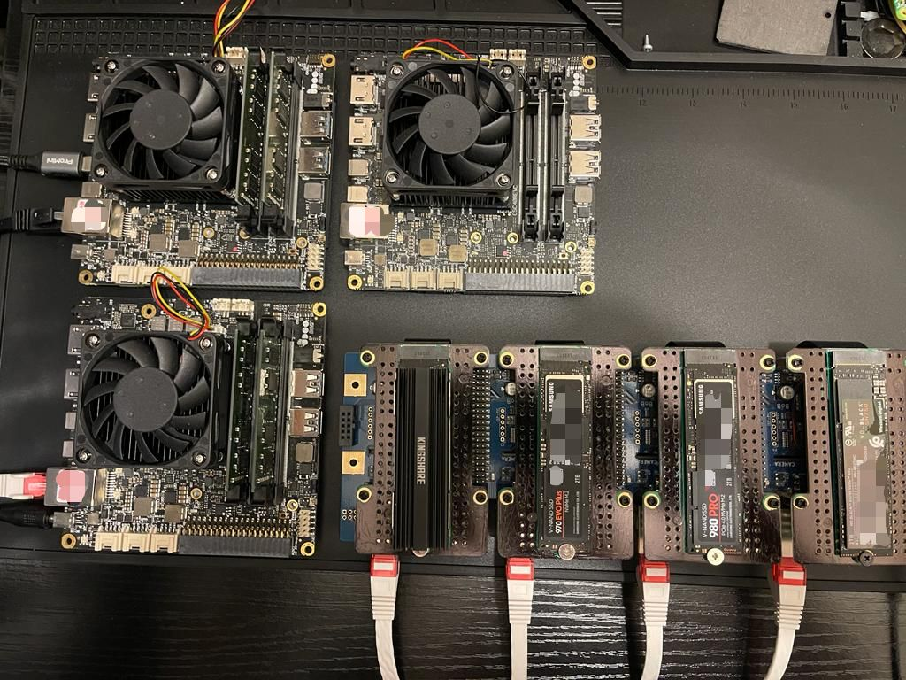

# P-cluster - High Performance Personal Computing Cluster - Overview

The aim of this project is to build a HPC cluster almost from scratch (without relying on public cloud providers) to test and deploy "cloud native" technologies and applications like:

* Container management: Kubernetes
* Event streaming: Kafka/Pulsar
* Distributed Computing
* CI/CD tools like Ansible
* Advanced networking 

Using mixed AMD64 / ARM64 architectures:

* 3X UDOO BOLT V8 boards
* 4X ROCKPI 4C boards
* (TBD) Dedicated GPU boards for ML

With the objective to use it as foundation to build/test:

* A stream based reactive microservices mvp for Conversational AI use cases
* Migration from commercial (privacy compromised) cloud services like Gmail, Google Docs to personal cloud services
* Geographically distributed personal cloud replicating this cluster in different countries using Nebula/Zero-Tier

---

### Overall set-up
---

